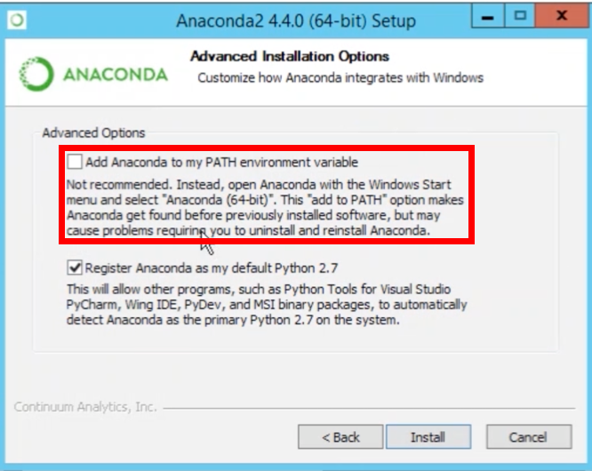

# instructions
Force git pull to overwrite local files:

`git reset --hard HEAD`

*or*

`git fetch origin master`

`git reset —hard FETCH_HEAD`

`git clean -df`

### Force push to git:

`git push origin <your_branch_name> -f`

### Creating webdashboard:
`mkdir githubsite`

`cd githubsite`

`git init`

`git status`

`git add .`

`git commit -m "first commit"`

`git remote add origin https://github.com/<githubusername>/<reponame>.github.io.git`

### Python

mac : Goto https://www.python.org/downloads/ and download latest version

windows : Goto https://www.python.org/downloads/windows/ and download latest version

### conda
mac : Goto https://conda.io/docs/user-guide/install/macos.html follow directions

windows : Goto https://conda.io/docs/user-guide/install/windows.html follow directions

#### Remember to add to PATH variable during installiation
To verify goto (Terminal/GitBash) and type `conda -V` or `conda list`.

#### Create conda environment

`conda create -n PythonData python=3.6 anaconda` 

`source activate PythonData`

`python --version`
#### Create first program
`cd Dekstop` will change to the desktop directory

`mkdir PythonStuff` will make a new directory/folder on the desktop.

`cd PythonStuff` will move to the newly created folder

`open .` on a Mac or `explorer .` in PC will open the current folder

`touch first_file.py` will create a file

`touch second_file.py` will create a second file

`start <filename>` will open <filename>.py in editor
  
`ls` will show what in the current directory

`cd ..` will move us up a director back to Desktop`

#### Github

`git add -A`

`git commit -m <msg>`

`git pull`
###### If made updates in the pulled repo then do:
`git fetch`

`git reset --hard origin/master`

### Api
1. http://www.omdbapi.com/apikey.aspx -OMDB
2. https://openweathermap.org/appid -OpenWeatherMap
3. https://developer.nytimes.com/signup- NyTimes
4. https://console.developers.google.com/apis- Google Maps
5. https://apps.twitter.com - Twitter

create api keys

#### tweepy

`source activate PythonData`

`pip install tweepy`

https://apps.twitter.com/
create app and create token

#### vader- sentiment analysis

`source activate PythonData`

`pip install vaderSentiment==2.5`

if it doesn't work try creating a new conda env:

`conda create -n newPythonData python=3.6 anaconda` 

`source activate PythonData`

`pip install vaderSentiment==2.5`

### IPYWIDGETS (http://ipywidgets.readthedocs.io/en/stable/user_install.html)

`pip install ipywidgets`

`jupyter nbextension enable --py widgetsnbextension`

When using virtualenv and working in an activated virtual environment, the --sys-prefix option may be required to enable the extension and keep the environment isolated (i.e. `jupyter nbextension enable --py widgetsnbextension --sys-prefix`).

#### via Conda

`conda install -c conda-forge ipywidgets`

`jupyter labextension install @jupyter-widgets/jupyterlab-manager`

To install the JupyterLab extension you also need to run the command below in a terminal which requires that you have nodejs installed.

`jupyter labextension install @jupyter-widgets/jupyterlab-manager`
Note: A clean reinstall of the JupyterLab extension can be done by first running the jupyter lab clean command which will remove the staging and static directories from the lab directory. The location of the lab directory can be queried by executing the command jupyter lab path in your terminal.

### Plotly(https://plot.ly/python/getting-started/)

`pip install plotly`

